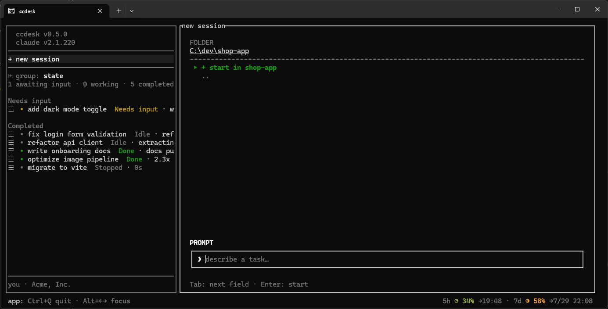

# ccdesk

A Claude Code session manager TUI, modeled after **Claude Desktop** and the built-in
**Agent View** — see, switch, and drive all your sessions in one terminal.

ccdesk embeds the official `claude` CLI in a PTY pane and keeps an Agent View–style
session list in a persistent sidebar (like Claude Desktop's session list). Each pane **is**
a foreground `claude` session that ccdesk owns, and the list itself lives in
`~/.ccdesk/sessions.json`, so closing ccdesk ends the processes while the rows stay —
reopen one and it resumes from its transcript.



## Features

- **Persistent sidebar** with every session ccdesk knows about across all projects,
  grouped by state (Needs input / Working / Completed) or by directory
- **Persistent projects** — a directory becomes a project the moment you start a session in it,
  and its heading stays in the directory grouping even after its last session is gone, so the
  way in is never lost. Clicking a heading opens `new session` / `remove project`;
  `remove project` is disabled while sessions remain there, since the folder would keep its
  heading anyway. Registrations survive a restart but are only visible in the directory
  grouping — the state grouping has no directory headings to show them on
- **Foreground sessions you own** — a new session starts as
  `claude --session-id <uuid>` in the pane and reopening a row resumes it with
  `claude -r`; `close` ends the process while the row stays (resume it any time) and
  `delete` drops the row (your transcripts in `~/.claude/projects/` are never removed)
- **A menu per row** — clicking the `=` at the head of a session row, or pressing `←` with
  the sidebar focused, opens `pin` / `mark as read` / `rename` / `close` / `archive` /
  `delete`. `close` is the only entry that greys out, and only when no window is open.
  Pinned rows sort to the top of their group; archived rows leave the normal list and
  collect under an `Archived` section at the bottom (in either grouping), which is where
  you `unarchive` them; `rename` turns the row itself into an input — `Enter` keeps the
  name, `Esc` throws it away. **None of these operations gets its own shortcut key**: one
  entry point means one thing to read, and every key ccdesk does not reserve is a key
  claude Code still gets. `←` is not reserved either — it only means "menu" while the
  sidebar has focus
- **Live status** from `claude agents --json` (state changes reflect in ~2 s)
- **Account line** in the sidebar footer, showing the signed-in Claude account, the same value
  `ccdesk doctor` prints. A login or logout that rewrites `~/.claude/.credentials.json` shows
  up in ~1 s; where credentials live outside that file, only the ~60 s refresh applies
- **Account switching** — **clicking anywhere on the account line** opens a menu of the accounts
  ccdesk has stored (`●` marks the one you are signed in as) plus `register current`, and picking
  a stored account offers `switch` / `unregister`. Registering copies the current
  `claudeAiOauth` credentials into `~/.ccdesk/accounts.json` under your account's email;
  switching writes them back, leaving `mcpOAuth` and every other key in
  `~/.claude/.credentials.json` untouched. Both take the same lock file claude Code uses for
  token refresh, and the outgoing account's tokens are folded into the store under that lock,
  so a rotated refresh token is never lost. Since Windows claude re-reads the credentials file,
  **live sessions move to the new account from their next message** — the menu says how many
  (`N sessions will switch`). Until the signed-in account is stored the line is prefixed with
  `⚠`: that is the reminder to register before your next `/login`, because
  `.credentials.json` only ever holds one account and the previous one is overwritten. Stored
  refresh tokens are single-use, so an account you have used elsewhere in the meantime can go
  stale; ccdesk does not probe for that ahead of time and the account line simply reports
  `not logged in · run /login` once the switch lands. Export/import and automatic rotation are
  deliberately out of scope
- **Version rows** at the top of the sidebar — `ccdesk vX.Y.Z` and `claude vX.Y.Z` — each with a
  `⟳` marker column and a verb at the right edge. When a newer version exists the row reads
  `⟳ ccdesk vX.Y.Z          update` and **clicking anywhere on it runs the update**, showing
  `updating…` while it runs. The marker column stays reserved when you are up to date, so
  nothing shifts sideways when an update appears. **Both updates apply on the next launch** —
  the running ccdesk and any live claude session keep the version they started with; the ccdesk
  row therefore switches to `restart` and stays there for the rest of the session, while the
  claude row clears once `claude --version` reports the new build. ccdesk's own check runs once
  per launch (no polling), and the download is verified by SHA-256 before anything is replaced
  (the same install path as `ccdesk update`). A native `claude` install also auto-updates in
  the background by default, so the claude row may clear itself without you doing anything
- **Mouse-first**: click to switch/focus, the `=` at the head of a row for what you can do
  to it, `⊞ group` row to switch grouping, account line for account switching, drag the
  border to resize
- **Keyboard**: ccdesk reserves exactly two things — `Alt+←/→` pane focus and `Ctrl+Q`
  quit. **Everything else passes through to claude untouched**, including `Ctrl+S` and
  `Ctrl+X`. With the sidebar focused, `↑↓` select, `Enter`/`→` opens the selected row and
  `←` opens its menu; on the new-session screen, `Tab` cycles fields and `Enter` runs the
  selected folder-list row
- **New-session screen** with a folder browser, editable path field (paste / drag & drop),
  and a first-prompt input. The list starts with a `+ start in <folder>` row, so you can
  launch a session in the folder you are browsing without typing a prompt first

## Requirements

- Windows 10/11 (ConPTY). Linux/macOS are untested.
- [Claude Code](https://claude.com/claude-code) CLI on `PATH`
- Rust toolchain (for installation from source)

## Install

### With cargo

```sh
cargo install --git https://github.com/HRYooba/ccdesk
```

### From Releases (no Rust required)

1. Download `ccdesk-x86_64-pc-windows-msvc.exe` from the
   [Releases](https://github.com/HRYooba/ccdesk/releases) page — a bare
   executable, no archive to unpack.
2. Rename it to `ccdesk.exe` (optional) and place it somewhere on your `PATH`.
3. Run `ccdesk`.

Each release also ships `ccdesk-x86_64-pc-windows-msvc.exe.sha256` in
`sha256sum` format, so you can verify the download with
`sha256sum -c ccdesk-x86_64-pc-windows-msvc.exe.sha256` (or compare
`certutil -hashfile ccdesk-x86_64-pc-windows-msvc.exe SHA256` by eye).
Asset names carry no version, so `ccdesk update` can build the URL itself.

(Developers working from a clone: `cargo install --path .`)

## Commands

```sh
ccdesk            # launch the TUI
ccdesk doctor     # diagnose the environment (claude CLI, account, config dir, terminal)
ccdesk logs       # print the path and tail of the error log
ccdesk update     # download the latest release, verify its SHA-256, and install it
ccdesk --version  # print version
ccdesk --help     # show usage
```

Settings (grouping, opt-ins) live in `~/.ccdesk/config.json`; window state
(sidebar width, last screen, last folder, registered projects) in `~/.ccdesk/state.json`.
Errors and panics are appended to `~/.ccdesk/error.log`.
Accounts you register from the account line are stored in
`~/.ccdesk/accounts.json` — it holds their OAuth tokens, so treat it exactly
like `~/.claude/.credentials.json` and never share or copy it elsewhere.

## Usage display (opt-in)

Add `"usage_display": "on"` to `~/.ccdesk/config.json` to show your Claude
rate-limit usage (5h / 7d windows, with time until reset) at the bottom right.

When enabled, ccdesk passes the official `--settings` flag to the `claude`
sessions it starts to install a status-line hook. The hook saves the
official rate-limit JSON that Claude Code provides to status lines, and then
chains to your own status line if you have one configured — your display keeps
working unchanged. No files outside `~/.ccdesk/` are modified, and sessions
opened outside ccdesk are unaffected.

## License

MIT
