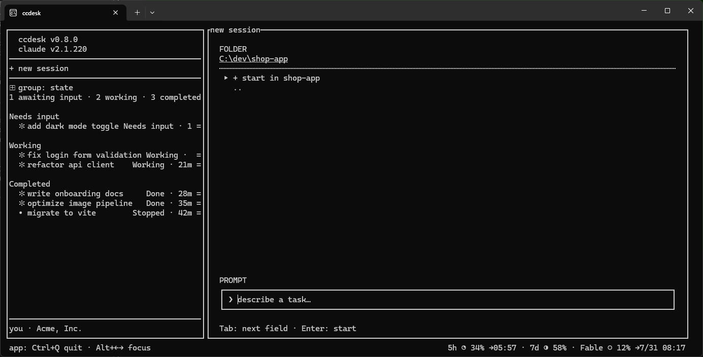

# ccdesk

A session manager TUI for Claude Code — see, switch, and drive all your sessions in
one terminal.

ccdesk embeds the official `claude` CLI in a PTY pane and keeps a session list in a
persistent sidebar. Each pane **is** a foreground `claude` session that ccdesk owns,
and the list itself lives in `~/.ccdesk/sessions.json`, so closing ccdesk ends the
processes while the rows stay — reopen one and it resumes from its transcript.



## Features

- **Persistent sidebar** — every session ccdesk knows about, across all projects,
  grouped by state (Waiting / Working / Completed / Stopped) or by directory
- **Foreground sessions ccdesk owns** — a row starts or resumes a real `claude`
  process in the pane; `stop` ends the process and keeps the row, `close` drops the
  row. Your transcripts in `~/.claude/projects/` are never removed
- **Persistent projects** — a directory stays in the directory grouping even after its
  last session is gone, so the way back in is never lost
- **Names that match what claude shows** — a row is named from its transcript and
  derived on every draw, so `/rename` in the pane is the only rename there is.
  **ccdesk never writes to claude's files**
- **Live status, never stored** — a row's state comes from claude's hooks each time the
  sidebar is drawn, so a row can never claim a state its process no longer has
- **Unread and pinned rows** — `●` marks a row claude spoke on while you were looking
  elsewhere; pinned rows move to a section at the top of the list
- **Version rows** for ccdesk and claude at the top of the sidebar — click one to update
  (verified by SHA-256; both apply on the next launch)
- **Account line** in the footer showing the signed-in Claude account. Display only —
  switch accounts with `/login` inside a session
- **Mouse-first, keyboard-light** — click to switch or focus, the `=` at the right end of
  a row for everything you can do to it. ccdesk reserves exactly two keys —
  `Alt+←/→` pane focus and `Ctrl+Q` quit — so **every other key passes through to
  claude untouched**
- **New-session screen** with a folder browser, editable path field, and an optional
  first prompt

## Requirements

- Windows 10/11 (ConPTY). Linux/macOS are untested.
- [Claude Code](https://claude.com/claude-code) CLI on `PATH`
- Rust toolchain (for installation from source)

## Install

### With cargo

```sh
cargo install --git https://github.com/HRYooba/ccdesk
```

### From Releases (no Rust required)

1. Download `ccdesk-x86_64-pc-windows-msvc.exe` from the
   [Releases](https://github.com/HRYooba/ccdesk/releases) page — a bare
   executable, no archive to unpack.
2. Rename it to `ccdesk.exe` (optional) and place it somewhere on your `PATH`.
3. Run `ccdesk`.

Each release also ships `ccdesk-x86_64-pc-windows-msvc.exe.sha256` in
`sha256sum` format, so you can verify the download with
`sha256sum -c ccdesk-x86_64-pc-windows-msvc.exe.sha256` (or compare
`certutil -hashfile ccdesk-x86_64-pc-windows-msvc.exe SHA256` by eye).
Asset names carry no version, so `ccdesk update` can build the URL itself.

(Developers working from a clone: `cargo install --path .`)

## Commands

```sh
ccdesk            # launch the TUI
ccdesk doctor     # diagnose the environment (claude CLI, account, config dir, terminal)
ccdesk logs       # print the path and tail of the error log
ccdesk update     # download the latest release, verify its SHA-256, and install it
ccdesk --version  # print version
ccdesk --help     # show usage
```

Settings (grouping, opt-ins) live in `~/.ccdesk/config.json`; window state
(sidebar width, last screen, last folder, registered projects) in `~/.ccdesk/state.json`.
Errors and panics are appended to `~/.ccdesk/error.log`.
An earlier build stored account credentials in `~/.ccdesk/accounts.json`; that
feature is gone, and ccdesk deletes the file (and its lock) once at startup,
noting it in the error log.

ccdesk passes the official `--settings` flag to the `claude` sessions it starts
to install turn-level hooks that report each session's state (working / waiting
for input / done) back to ccdesk — that is what the sidebar shows. The hooks
run `ccdesk hook <event>`, so no external scripts are installed, and they write
only to `~/.ccdesk/hook-states.json`. **`hooks` is the only key ccdesk injects**:
Claude Code merges hooks across settings sources, so yours keep running, and no
other setting of yours is replaced for that session. Sessions opened outside
ccdesk are unaffected.

## Usage display (opt-in)

Add `"usage_display": "on"` to `~/.ccdesk/config.json` to show your Claude
rate-limit usage at the bottom right: the 5-hour window, the 7-day window, and
each per-model weekly window, with time until reset. Narrow terminals drop the
reset times first, then the per-model windows.

**Click it to refresh right away** instead of waiting for the next poll — the
numbers dim while the fetch is in flight. Otherwise ccdesk refreshes every two
minutes, and stops polling entirely on accounts that have no rate-limit windows
(a click still re-checks, in case you signed in elsewhere).

ccdesk gets the numbers by running the official `claude` CLI headless for a
moment and sending one `get_usage` request over the Agent SDK control channel.
No model runs, so no tokens and no rate-limit quota are consumed.

It is opt-in because this is the one thing ccdesk does that reaches Anthropic's
servers while you are not there — everything else it polls is local. Consumer
Terms §3 permits automated access to the Services via an API key "or where we
otherwise explicitly permit it", and running a documented feature of the
official CLI against your own subscription, for yourself, reads as permitted,
but that is a reading and not a ruling. Leave the setting out and the fetch
thread never starts.

`ccdesk doctor` reports what the probe returns on your machine, and runs even
with the setting off so you can look before turning it on. A failed fetch shows
as `usage —` rather than a silent blank; a reading older than 10 minutes is
dimmed; an account with no rate-limit windows at all (API key, Bedrock, Vertex)
hides the gauge instead of warning forever.

## License

MIT
