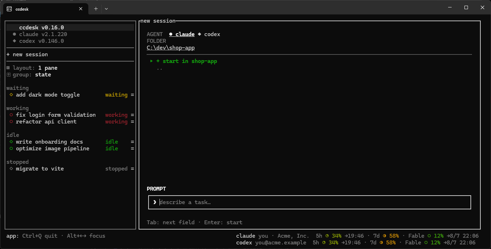

# ccdesk

A session manager TUI for Claude Code — see, switch, and drive all your sessions in
one terminal.

Each row **is** a real foreground `claude` session. The list outlives them: closing
ccdesk ends the processes but keeps the rows, and reopening one resumes the
conversation. OpenAI's `codex` CLI works the same way — [opt in](#codex-opt-in).



## Features

- **One list for every session**, across all projects — group it by state, by
  directory, or by agent
- **Start, stop, and resume from the sidebar** — `stop` ends the process and keeps the
  row, `close` drops the row. Your transcripts are never touched
- **Folders stay** in the directory grouping after their last session is gone, so the
  way back in is never lost
- **Rows are named by the agent**, not by ccdesk — rename with `/rename` in the session
- **Status you can trust** — each row shows what its process is actually doing right
  now (Waiting / Working / Idle / Stopped)
- **Unread marks and pinning** — `●` for rows that spoke while you were elsewhere;
  pinned rows sit at the top
- **In-place updates** for ccdesk and each agent, from rows at the top of the sidebar
- **Up to four sessions side by side** — pick one of eight layouts from the
  `▦ layout` row. Sessions are not split into panes, they are *placed* into slots:
  choosing a row moves that session into the focused slot, and only that one moves —
  the slot it came from goes empty. Nothing is ever killed by rearranging
- **Mouse-first, keyboard-light** — click to switch, the `=` at the end of a row for
  everything else, drag the cross between slots to resize. ccdesk reserves
  `Ctrl+Q`, `Alt+←/→` (sidebar ⇄ main view) and `Alt+Shift+←/→/↑/↓` (move between
  slots) — and **every other key goes to the agent untouched**
- **ccdesk never modifies your agent's config or files.** It installs its status hooks
  per session only, and sessions you open outside ccdesk are unaffected

## Requirements

- Windows 10/11. Linux/macOS are untested.
- [Claude Code](https://claude.com/claude-code) CLI on `PATH`
- [Codex](https://developers.openai.com/codex/cli) CLI on `PATH` — only with codex on
- Rust toolchain (to install from source)

## Install

```sh
cargo install --git https://github.com/HRYooba/ccdesk
```

Or grab `ccdesk-x86_64-pc-windows-msvc.exe` from
[Releases](https://github.com/HRYooba/ccdesk/releases) and put it on your `PATH`.
Each release ships a matching `.sha256`.

## Commands

```sh
ccdesk            # launch the TUI
ccdesk doctor     # diagnose the environment
ccdesk logs       # print the path and tail of the error log
ccdesk update     # update to the latest release
ccdesk --version
ccdesk --help
```

## Sessions talking to each other

A few more commands exist **for the agent running inside a session**, not for you.
They only work from a session, and they only reach sessions this same ccdesk started
or stopped.

```sh
ccdesk list                        # the sessions this ccdesk knows, running or not
ccdesk send <session> <text>       # type text into another session and submit it
ccdesk read <session> [-n 20]      # that session's last messages
ccdesk read <session> --screen     # what that session looks like right now
ccdesk new [prompt]                # start another session and print its id
ccdesk stop <session>              # end its process, keep the row
ccdesk close <session>             # end its process and drop the row
```

`<session>` is the start of a name or of the id from `ccdesk list`; ambiguous names
fail and print the candidates rather than pick one.

- **`send` does not wait, and does not mark what it sends.** The text arrives exactly
  as written — the agent there cannot tell it from something you typed. The answer is
  something you go and `read`.
- **`read` works after a session ends** — it opens the agent's own transcript, so the
  conclusion of a helper session is still there to collect. It doesn't need ccdesk to
  be responsive either. Only `--screen` asks the running ccdesk, and gives up after 5
  seconds.
- **A session that is no longer running still answers `read` and `close`**; `send`,
  `stop`, and `read --screen` need a live process and say so rather than fail
  silently. `ccdesk list` marks which is which.
- **`new` prints the id it minted**, so the next command can address it. It takes
  `--agent claude|codex` and `--cwd <dir>`, both defaulting to the caller's. It does
  not steal the pane: what you were watching stays on screen.
- **None of them can target the calling session.** `stop` and `close` would kill the
  process running the command, which cannot then report what happened.

Settings are in `~/.ccdesk/config.json`, errors in `~/.ccdesk/error.log`. Both
optional features are one line each:

```json
{ "codex": "on", "usage_display": "on" }
```

## Codex (opt-in)

Turn it on and codex sessions join the same list — same rows, same menu, same states —
and `agent` becomes a third way to group. A folder's menu asks which agent to start,
so it never launches something you did not pick.

It is off by default so that people without codex installed never pay for it. Turning
it off later hides your codex rows without deleting them.

Two things come from codex itself, not ccdesk:

- A codex row has no name until you send your first prompt.
- Codex prints a trust warning on every launch. ccdesk takes the warning rather than
  write hook settings into your `~/.codex/config.toml`.

## Usage display (opt-in)

Shows your rate-limit usage at the bottom right, one line per agent: the 5-hour
window, the 7-day window, and each per-model weekly window, with time until reset.
It stays current on its own, and you can click it to refresh now.

It is opt-in because it is the only thing ccdesk does that reaches the provider's
servers while you are away — everything else it watches is local. It consumes no
tokens and no rate-limit quota. `ccdesk doctor` shows what it would report on your
machine, so you can look before turning it on.

## License

MIT
