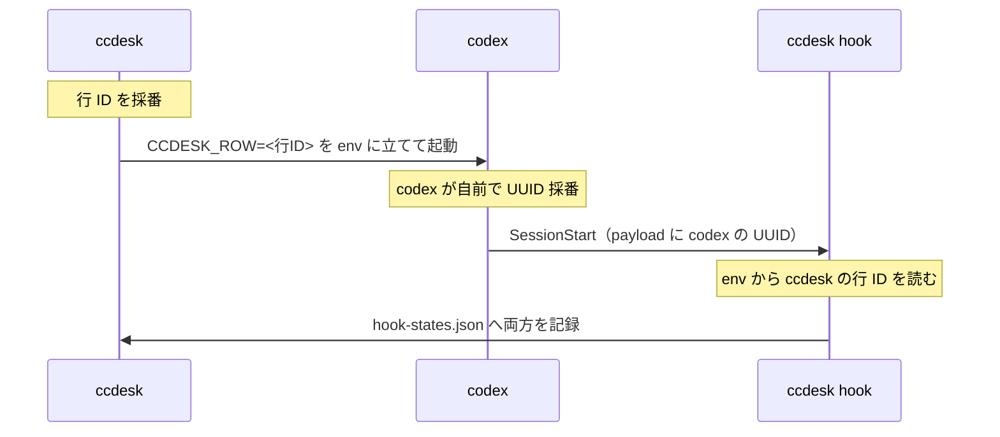
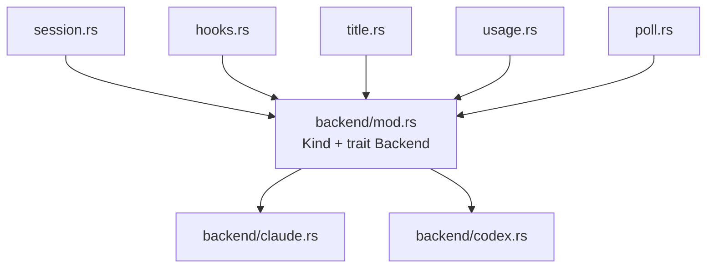

# codex 対応の設計

ccdesk が claude だけでなく codex のセッションも一覧・起動・状態表示できるようにする。

このドキュメントは**決定と理由**を残すもので、コードの写しではない。実装の詳細は
コード側のドキュメンテーションコメントが正本。

---

## 計測の前提

以下の「実測」は次の環境で確認したもの。**codex は非公開の内部形式に依存する箇所が
あるので、版が変われば取り直しが要る。**

| 項目 | 値 |
|:--|:--|
| 計測日 | 2026-08-02 |
| codex CLI | 0.146.0 |
| OS | Windows 11 Pro 26200 |

---

## 1. 検証で確定した事実

### 1.1 codex には hook がある

`codex features list` で `hooks` は **stable / 既定 ON**。実測でイベントが発火した。

**codex のイベント集合は claude の部分集合で、State への対応も同一**。よって
`HOOK_EVENTS` の表も `run_hook` の受け口も変更不要。

| event | claude | codex | State |
|:--|:--:|:--:|:--|
| SessionStart | ✓ | ✓ | Idle |
| UserPromptSubmit | ✓ | ✓ | Working |
| PermissionRequest | ✓ | ✓ | Waiting |
| Stop | ✓ | ✓ | Idle |
| SessionEnd | ✓ | ✓ | Stopped |
| Notification | ✓ | — | Waiting |
| StopFailure | ✓ | — | Idle |

hook が stdin で受け取る JSON のキーは claude と同じ `session_id`。加えて codex は
`transcript_path` / `cwd` / `model` / `permission_mode` を渡す。turn スコープの
イベントには `turn_id` が付く。

`PermissionRequest` には `tool_name` と `tool_input` が乗る（claude の `Notification`
は理由文字列だけなので、**codex の方が情報量が多い**）。

### 1.2 rollout は遅延生成されるので ID の発見には使えない

codex の transcript にあたるファイル（rollout）は、セッション開始時点では
**ディスク上に存在しない**。公式実装（`codex-rs/rollout/src/recorder.rs`）が
`writer: None` + `deferred_log_file_info` で持ち、最初のアイテムが積まれて初めて
ファイルを開く。

実測: `session_meta` の時刻から最初のユーザー発話まで最大 332 秒空いたセッションが
あった（195 本中）。

**よって「起動後に rollout を監視して session_id を発見する」は成立しない。**
`SessionStart` hook が `session_id` と `transcript_path` を即座に渡すので、監視自体が
不要になる。

### 1.3 使用率はターンを起こさずに取れる

`codex app-server` の JSON-RPC メソッド `account/rateLimits/read`。claude 側の
`get_usage` と同じ性質を実測で確認した。

**rollout にも `rate_limits` は載るが、そちらは最後にセッションが動いた時点の値。**
実測で rollout の最新が 1%、この経路が 2% だった ＝ 現在値が要るならこちらを読む。

| | claude | codex |
|:--|:--|:--|
| 経路 | ヘッドレス起動 + 制御チャンネル | `codex app-server` + JSON-RPC |
| 課金・枠消費 | ゼロ | ゼロ |
| transcript / rollout | 作らない | 作らない |
| 設定の書き換え | 無し | 無し |
| 鮮度 | 今の値 | 今の値 |

`account/read` でアカウント（email + planType）も取れる。

**app-server は公式ドキュメントのある third-party 向けインタフェース**（VS Code 拡張が
これで動く。`generate-ts` / `generate-json-schema` サブコマンドが用意されている）。
ただし `account/*` メソッド群は**ドキュメントに載っていない** ＝ 予告なく変わり得る。
CLI では `[experimental]` 表記。

呼ぶときは `initialize` → `initialized` → 本題の 3 手。応答が返るまで stdin を開いた
まま待つ必要がある（閉じると無応答で終了する）。

### 1.4 Windows では `.cmd` を自前で解決する必要がある

`std::process::Command::new("codex")` は `codex.cmd` を見つけない（`CreateProcess` は
`PATHEXT` を見ない）。claude は native インストールで `claude.exe` なので露見して
いなかったが、npm 経由で入る agent は `.cmd` のシムしか持たない。

さらに npm は同じディレクトリへ **`codex`（sh のシム）と `codex.cmd` を並べて置く**ので、
拡張子なしを先に採ると Windows が実行できない方を掴む。

解決は [`ccdesk::resolve_program`] 1 箇所（PATH × PATHEXT。拡張子付きを先に見る）。

### 1.5 env は hook の子プロセスまで継承される

ccdesk が起動時に立てた環境変数が、codex を経由して hook のプロセスまで届く。実測:

```
{"CCDESK_ROW": "row-abc-123", "argv": ["hook", "SessionStart", "idle"]}
```

これが行の相関（§2.1）の土台になる。

### 1.6 hook のコマンドに二重引用符を入れられない

`-c hooks={…}` の `command` は 1 本の文字列で渡す。そこに二重引用符を入れると、
**npm の `.cmd` シムを通る間に `""` へ二重化される**。実測:

```
ccdesk が渡す:  command='"C:/…/ccdesk.exe" hook SessionStart idle'
codex に届く:   command='""C:/…/ccdesk.exe"" hook SessionStart idle'
```

codex はその名前のプログラムを起こそうとして失敗する。画面には
`hook exited with code 1` が並び、**hook は 1 度も起動されない**（＝ 状態も
`agent_id` も記録されないので、色・rename・resume が丸ごと死ぬ）。

`codex exec` を PowerShell から叩くと通ってしまうので、**ペインの中でしか再現しない**。

argv 配列で渡す逃げ道は無い（`invalid type: sequence, expected a string`）。
囲めない以上パスに空白があってはならず、あるときは 8.3 短縮名へ落とす
（[`ccdesk::short_path`]）。落とせなければ hook を注入しない。

---

## 2. 設計

### 2.1 行の identity — codex は起動前に ID を採番できない

codex に `--session-id` 相当のフラグは無い（`codex --help` 全項目で確認）。



`SessionRow` に 2 つ足す。

- `kind: Kind` — claude か codex か
- `agent_session_id: Option<String>` — `codex resume <uuid>` に要る

claude では `agent_session_id == session_id`（ccdesk が採番を強制しているため）。

**hook の記録の鍵は env の `CCDESK_ROW`。** 読めなければ従来どおり payload の
`session_id` へ落ちるので、古い `inject-settings.json` を掴んだままの claude
プロセスも壊れない。

### 2.2 相関を env に置く理由

`-c` のコマンド文字列に行 ID を埋める案もあったが、env を選んだ。

**hook のコマンド文字列が起動ごとに変わらない**ので、codex の trust ハッシュが安定する。
今は trust をバイパスする（§2.4）が、将来 trust 方式へ切り替える退路が残る。

claude 側には `CLAUDE_PID_ENV` を env から読む先例がある。

### 2.3 backend モジュール

kind 固有の知識が `session.rs` / `hooks.rs` / `title.rs` / `usage.rs` / `poll.rs` の
5 箇所に散る。`match kind` を撒くと「codex の何かを直す」が 1 箇所に閉じない。



trait が持つ責務は 5 つ。

| 責務 | claude | codex |
|:--|:--|:--|
| 起動コマンド | `--session-id` / `-r` | `resume` サブコマンド |
| hook 注入 | `--settings <file>` | `-c hooks={…}` + bypass フラグ |
| 表示名 | transcript | `~/.codex/session_index.jsonl` の `thread_name` |
| 使用率 | ヘッドレス + `get_usage` | app-server + `account/rateLimits/read` |
| 沈黙時の補正 | 不要 | 必要（§2.5） |

`session.rs` 等は kind を見ない。backend に聞くだけ。新しい agent を足すときは
`backend/` にファイルが 1 枚増える。

### 2.4 hook 注入は `-c` + trust バイパス

codex には `--settings` に相当する「この起動限りの注入口」が公式に無い。hook の
探索先は `~/.codex/{hooks.json,config.toml}` と `<repo>/.codex/{hooks.json,config.toml}`
の 4 つで、いずれも**ユーザーの設定ファイル**。

`-c 'hooks={…}'` で 1 起動限りの上書きは効くが、trust の壁がある。実測では
`Hooks need review / 5 hooks are new or changed` の画面が出て、承認すると
`~/.codex/config.toml` に `[hooks.state]` としてハッシュが 5 件書かれた。

**`--dangerously-bypass-hook-trust` を使う。** 実測で config への書き込みはゼロ
（バイト単位で一致を確認）。ccdesk が claude 側で守っている「ユーザー設定を
1 バイトも書き換えない」がそのまま成り立つ。

代償が 2 つある。

- ペイン内に警告が毎回 2 行出る
- ユーザー自身の hook も無審査で走る

`-c` に渡す値は **TOML のリテラル文字列（`'…'`）で組む**。二重引用符は
npm shim → cmd → exe のどこかで食われ、値が TOML として解釈されずに落ちる。

### 2.5 Esc 中断で Stop が来ない

codex は Esc でターンを中断しても `Stop` hook が発火しない
（[openai/codex#22858](https://github.com/openai/codex/issues/22858)、OPEN）。

claude は自前の `status` が `idle` へ戻るので自己修復するが、codex には status に
相当するものが無い。放置すると **Working（赤）が固着する**。

対策: hook が Working かつ PTY が 2 秒無出力なら Idle へ落とす。既存の `PtyHint` を
そのまま使い、`Backend` が「この補正が要るか」を答える。

---

## 3. UI

### 3.1 記号を新設しない

調べた範囲では **claude と codex を 1 画面に並べる慣習は存在しない**。

- claude 公式の記号は `✻`（1 桁）
- codex 公式の記号は `>_`（2 桁。`codex-rs/tui/src/history_cell/session.rs` の
  セッションバナー）
- **幅が違うので列が揃わない**
- 最も近い実装（mulmoterminal）は記号を使わず `"Claude"` / `"Codex"` のテキスト

さらに ccdesk は過去に状態アイコン（`✻` / `✽` / `∙`）を廃止した経緯がある。同じ記号を
別の意味で復活させると、その履歴と衝突する。

**よって、幅が足りない場所だけ略記する。**

| 場所 | 表記 |
|:--|:--|
| サイドバーの行（幅が足りない） | `[cc]` / `[cx]` |
| 版行・使用率行・grouping の見出し | `claude` / `codex`（名前をそのまま） |

### 3.2 画面

```
┌─ sidebar ──────────────────┬─ pane ─────────────────────┐
│ ccdesk v0.11.0             │                            │
│ claude v2.1.220     update │                            │
│ codex  v0.146.0            │                            │
│ ────────────────────────── │                            │
│ pinned                     │                            │
│ ❯● [cc] fix login form   ⋮ │                            │
│                            │                            │
│ Waiting                    │                            │
│  ● [cx] codex での調査   ⋮ │                            │
│                            │                            │
│ Working                    │                            │
│  ○ [cc] refactor poll    ⋮ │                            │
└────────────────────────────┴────────────────────────────┘
                claude  ooba · 1-10, Inc.  5h ◔ 34% →05:35 · 7d ◑ 58%
 app: Ctrl+Q…   codex   ooba@1-10.com      7d ○ 2% →8/6 07:55
```

下部バーは **2 行**。キーヒントは今までどおり**最下行の左**、使用率は 2 行を
**ブロックとして右寄せ**し、ブロック内は左揃え（agent 名とアカウント列が縦に揃う）。

notice が出ている間は最下行がそれに置き換わり、使用率は消える（今と同じ）。行数は
変えない ＝ notice の出入りでペインの高さが動かない。

| 項目 | 決定 | 理由 |
|:--|:--|:--|
| 種別の表示 | 名前の接頭 `[cc]` / `[cx]` | ドットの 4 チャンネル（形・塗り・色・明滅）を崩さない |
| 最小幅 | `MIN_NAME_COLS` を広げる | 接頭辞ぶん名前の下限を確保する。サイドバー最小幅も連動して増える |
| 版行 | agent ごとに 1 行（計 3 行） | 1 行へ詰めると横 68 桁を食い、更新導線も行単位で押せなくなる |
| アカウント | サイドバーから外し、使用率行の左へ置く | 同じ行に「誰の枠か」と「残り」が並ぶ。サイドバーのフッターが不要になる |
| 使用率 | 下部バー 2 行 | claude は枠が 3〜5 個あり 1 行に同居できない |
| grouping | `state` / `directory` / **`agent`** の 3 軸 | 種別で見たいときの入口 |
| 新規起動 | New 画面に Agent 切替行 | 起動の入口を 1 つに保つ |

種別で節を分けるのは grouping が `agent` のときだけ。**directory のときは同じ
プロジェクトのセッションが種別に関わらず同じ節に並ぶ。**

行数の収支: 版行 +1、サイドバーのフッター −2、下部バー +1 ＝ **見えるセッション行は
増減しない**（`term_h - 8` のまま）。

未ログインは下部バーのその行に出る（`codex   not logged in`）。**色は
[`C_ATTENTION`]（黄）を維持する** ＝ サイドバーから移しても気づきやすさを落とさない。

### 3.3 起動の入口は 2 つある

New 画面のほかに、フォルダ見出しの `⋮` メニューの `new session` がある。こちらは
**New 画面を通らず即起動する**（`dispatch_session`）ので、Agent 切替行が効かない。

**メニューを 2 項目に分ける。**

```
  ▸ new claude session
  ▸ new codex session
  ▸ remove project
```

黙って既定で起こすと「押すまで何が起きるか分からない」ため。将来 agent が増えると
項目が線形に伸びるが、そのときに畳み方を考える。

### 3.4 その他の面

| 面 | 決定 |
|:--|:--|
| 行メニューの `open` | `agent_session_id` 未取得なら**無効化**（`remove project` と同じ `enabled` の仕組み）。窓は通常 5 秒以内に閉じる |
| 右ペインのキーヒント | `all keys pass through to <agent>` ＝ 開いている窓の kind から導く |
| 右ペインの枠タイトル | 変えない。中身の TUI が自分の素性を出している（codex は `>_ OpenAI Codex`） |
| `ccdesk doctor` | codex のチェックを足す。ただし **codex が PATH に無いのは FAIL ではない**（ccdesk は claude だけでも動く）ので Warn 止まり |
| 撮影用データ（`--demo`） | codex の行を混ぜる。**README のスクリーンショットは撮り直しが要る**（撮影は実機の TUI で行う ＝ `screenshots/screenshot.ps1`） |

---

## 4. 実装順序

**進捗は git 履歴と `src/backend/` の中身が正本。** ここは順序と、各段で何を
「終わり」とみなすかだけを書く（済/未のチェックは書かない ＝ 手で維持すると腐る）。

1. `backend` モジュール新設 + claude を移設。`Kind` を `SessionRow` へ。
   **振る舞いを変えない**（起動するのは claude だけ）
2. hook の受け口を行 ID 基準にする（[`crate::hooks::ROW_ENV`] を読む）＋
   `agent_session_id` を行へ
3. codex の表示名（`session_index.jsonl`）
4. UI（接頭辞・最小幅・版行・New 画面の Agent 行・見出しメニュー・grouping）
5. 使用率 2 行 + アカウント行の移動
6. Esc 対策（§2.5）

1 は独立して安全なので単独で出せる。2 以降は codex の行が実際に生まれるので、
実機確認が要る。

---

## 5. 既知の地雷

| 事象 | 出典 | 状態 |
|:--|:--|:--|
| Esc 中断で Stop が発火しない | [#22858](https://github.com/openai/codex/issues/22858) | OPEN。§2.5 で対策 |
| Windows + 非 ASCII で hook の payload が壊れる | [#23784](https://github.com/openai/codex/issues/23784) | OPEN。0.146.0 では**再現せず** |
| `account/*` が非公開 | — | 壊れたら使用率行が消えるだけに留める |
| app-server が `[experimental]` | CLI ヘルプ | 同上 |

### 検証時に踏んだ落とし穴

**hook のプローブが非 ASCII の payload を無言で捨てた。** Windows の Python は stdin を
cp932 で復号するため、日本語を含む payload で落ちる。exit 0 で何も記録せずに終わるので
「codex が hook を呼ばなかった」ように見えた。stdin はバイナリで読むこと。

`codex exec` は承認ポリシーを `never` に強制上書きするので、`PermissionRequest` は
exec では起こせない。TUI が要る。
