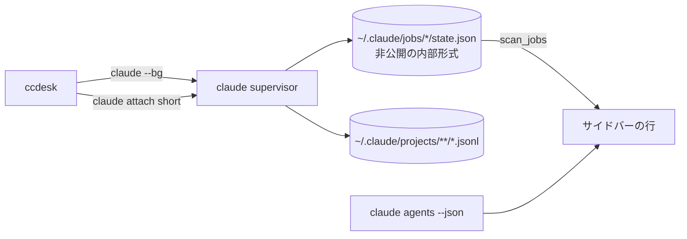
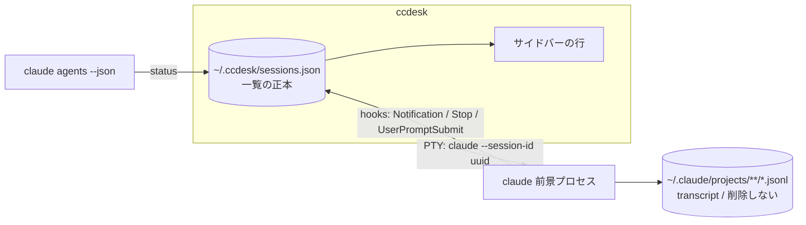

# 前景セッションへの移行

`claude --bg`（バックグラウンド + `claude attach`）で起こしていたセッションを、
**前景起動**（`claude --session-id <uuid>`）へ移行する。

この文書は「なぜそうするか」と「決めたこと」を持つ。**実装の詳細（JSON のキー名・
マージの手順・ロックの待ち時間）はコード側の doc コメントが正本**で、ここには写さない
（写すと片方だけ直った状態が黙って生まれる）。

- 一覧のストア: `src/sessions.rs`
- 供給元の口: `src/source.rs` の `DataSource`
- 排他と原子的書き込み: `src/lib.rs` の `Lock` / `write_json_atomically` / `reap_leftover_tmp`

## なぜ移行するか

`--bg` はセッションの実体を claude の supervisor に置き、ccdesk はその
`claude attach` クライアントに過ぎない。ここから来る制約が 3 つある。

1. **一覧の正本が ccdesk の外にある。** サイドバーの行は
   `~/.claude/jobs/*/state.json` の直読みで、これは**公式に文書化されていない内部形式**。
   claude 側の都合で形が変わると一覧が黙って壊れる。
2. **行に出せる情報が supervisor の都合で決まる。** 要約文（`detail` / `needs` /
   `output.result`）は state.json にしか無く、ライブ状態（`claude agents --json`）とは
   別の鮮度で動く ＝ 行の中で 2 つの時刻が混ざる。
3. **transcript の扱いが読めない。** `--bg` のセッションは
   `~/.claude/projects/**/*.jsonl` の書かれ方が前景と異なり、再開（`-r`）の体験が揃わない。

前景起動なら実体は ccdesk の子プロセスになり、**一覧の正本を ccdesk 自身が持てる**。
Claude Desktop も同じ構造（独自の JSON ストアを一覧の正本にする）。

## 確定仕様

| 項目 | 決定 |
|:--|:--|
| 起動 | PTY で `claude --session-id <uuid> -n <title>`。`CLAUDE_CODE_CHILD_SESSION` / `CLAUDE_CODE_SESSION_ID` / `CLAUDE_PID` / `CLAUDECODE` / `CLAUDE_JOB_DIR` 等の継承環境変数を除去（継承すると transcript 保存が無効になる実測あり） |
| 一覧の正本 | `~/.ccdesk/sessions.json` |
| title | CLI 本体と同じ優先順: `customTitle` > `aiTitle` > `lastPrompt` > `firstPrompt`。ccdesk のリネームは customTitle の位置 |
| state | hooks（`Notification`=入力待ち / `Stop`=完了 / `UserPromptSubmit`=実行中）+ `claude agents --json` の `status`。**要約文は出さない** |
| 未読 | `updated_at > last_opened_at`。状態ラベルの前に `●` |
| メニュー | ピン留め / 既読にする / 名前を変更 / 閉じる / アーカイブ / 削除 |
| ショートカット | `Ctrl+S` `Ctrl+X` を撤去。予約は `Ctrl+Q` と `Alt+←→` のみ |
| 削除の意味 | ccdesk の一覧から消すだけ。`~/.claude/projects/**/*.jsonl` は消さない |
| 失うもの | ccdesk 終了で全セッション終了（行は残り `-r` で再開）/ 外部からの `claude attach` 不可 / PR番号による Ready for review |

**要約文を出さない**のは項目の削減ではなく、正本を 1 つにするための帰結:
要約は state.json（内部形式）にしか無く、前景セッションはそれを書かない。
行に出るのは「状態」だけになり、状態の出どころは hooks と `agents --json` の 2 つ
（どちらも公式 IF）に揃う。

## データの流れ

移行前 — 一覧の正本が ccdesk の外（内部形式の直読み）:

移行後 — 一覧の正本は ccdesk、状態は公式 IF だけから来る:

行の identity は `session_id`（起動時に ccdesk が採番する UUID）。
`claude --session-id` へ渡した値がそのまま transcript の `sessionId` になるので、
**ccdesk の行と claude 側の記録が同じ鍵で結びつく**（`short` のような ccdesk 独自の
中間 ID を持たない）。

## 一覧の正本を持つことで解く問題

`~/.ccdesk/sessions.json` は **ccdesk を複数起動すると共有される**。
これは登録プロジェクト（`~/.ccdesk/state.json` の `projects`）と同じ問題で、
同じ形で解く:

- 書く前にディスクを読み直し、**3 方向マージ**（disk / baseline / next）してから置く
- `baseline` ＝「ディスクはこうなっている」とこのインスタンスが最後に判断した内容。
  `next` との差が**このインスタンスの操作**なので、「消した」と「知らない」を区別できる
- 排他は既存の advisory lock（`Lock`）、置き換えは `write_json_atomically`（tmp → rename）、
  rename 前に死んだ tmp は起動時に `reap_leftover_tmp` が回収する

守る不変条件は 2 つ。**他インスタンスが起こしたセッションを一覧から落とさない**
（落とすとプロセスは生きているのにどのウィンドウからも開けなくなる）ことと、
**自分が消した行を自分の次の書き込みで復活させない**こと。
行ごとの衝突（同じセッションを両方が触った）は `updated_at` の後勝ちで決める。
詳細な意味論は `src/sessions.rs` の `merge_sessions` の doc コメントが正本。

**上限は設けない。** 登録プロジェクト（自動登録なので溢れる）と違い、行が増えるのは
ユーザーがセッションを起こしたときだけで、減らす手段（アーカイブ・削除）もある。
上限で押し出すとユーザーが起こしたセッションが黙って消える。

## フェーズ

移行は 4 段階に割る。各段階の終わりで `cargo build` / `cargo test` が通り、
**アプリとして壊れていない**状態を保つ。

### フェーズ1: 一覧のストアを足す（この文書と同時に入る）

- `SessionId` newtype / `TitleSource` / `SessionRow` / `SessionStore`（`src/sessions.rs`）
- `DataSource::sessions` / `store_sessions`（`LiveSource` / `DemoSource` / テスト供給元）
- 単体テスト（マージ・ロック・原子的書き込み・tmp 回収）

**追加のみで、既存の bg 経路には触らない。** 新しいストアはまだ UI から使わない。

`SessionId` をこの段階で入れるのは、`short`（jobs ディレクトリ名）と `sessionId`
（UUID）がどちらも素の `String` だと、**移行を半分だけやってもコンパイルが通る**ため。
型で止める。

### フェーズ2: 所有権を supervisor から ccdesk へ移す（済）

**この段階の本質は起動コマンドの差し替えではなく所有権の反転。** ccdesk の PTY が
`claude attach` のクライアントではなく**セッションそのもの**になり、
「窓を閉じる = プロセスを終わらせる」に変わった。

- `Session::spawn` を前景起動へ（新規 `claude --session-id <uuid> -n <title> [prompt]` /
  再開 `claude -r <session-id>`）。UUID は ccdesk が採番する（`uuid` crate）
- 継承環境変数の除去（上表の一覧）。`env_clear` ではなく個別除去
  （`CommandBuilder::env_remove`）＝ PATH 等は残す
- 一覧の生成元を `jobs()` から `sessions()` へ載せ替え、`DataSource::jobs` /
  `scan_jobs` / `BgJob` / `iso_to_epoch_ms` を削除。サイドバーの行生成は
  「自 PTY 行 + job 行」の 2 ループから**行の一覧 1 本**へ統合した
- `App` の持ち物を「窓（`windows`）」と「行（`sessions`）」に分けた。
  行の identity は `SessionId`（`RowAction::Open` / `PopupKind::Session` /
  `pending_delete` まで型で通してある）
- stop / delete は `claude stop|rm` の起動ではなく `child.kill()` + ストア操作へ。
  **stop でも行は消さない**（`last_state` を `stopped` にして残す）
- bg 前提で意味を失ったものを削除: `spawn_rx` / `SpawnOutcome`（PTY 起動は同期で
  数 ms なので別スレッドが要らない）/ 多重ディスパッチの抑止 /
  `rescan_hot_until`（stop・delete が即時反映になった）/ `seen_alive` と
  `agents --json` の pid 消失による外部 stop 追従（生死は `child.try_wait()` が真実）/
  `run_claude_silent` / `Group::ReadyForReview`（PR 番号は state.json にしか無い）
- `input_gate` は**意味を変えて残した**。宛先は起動時点で決まるので守る対象は
  「子が端末を掴む前の打鍵」になり、降ろす合図は最初の出力（`Session::started`）と
  期限切れの 2 つ。`-r` の再開は読み直しに時間がかかるのでこれが要る
- `poll::AgentInfo` は `sessionId` / `kind` / `status` / `pid` だけを読む形へ。
  state はフェーズ3までの暫定として `status`（busy → Working / それ以外 →
  Needs input）と PTY 生存（無ければ Stopped）から出す
- 一覧の読み書きを UI に繋ぎ、`src/sessions.rs` 冒頭の `#![allow(dead_code)]` を外した

### フェーズ3: 状態・title・未読

- hooks（`Notification` / `Stop` / `UserPromptSubmit`）で `last_state` を更新
  （フェーズ2 が書くのは `stopped` だけ。生きている行の状態は毎周
  `agents --json` から導いていて保管に残っていない）
- `claude agents --json` の `status` と突き合わせる
- title の優先順（上表）を実装。ccdesk のリネームは `customTitle` の位置
  （フェーズ2 の title は起動時のプロンプト先頭 30 桁 ＝ `TitleSource::Derived` 固定）
- 未読（`updated_at > last_opened_at`）と `●` の描画（判定は
  `SessionRow::unread` が既に持っている）

### フェーズ4: メニューとショートカット（済）

**この段階の本質は操作の入口を 1 つにしたこと。** 行への二次操作は
`☰` のメニューだけが持ち、ショートカットキーは併設しない。入口が 2 つあると
どちらが正なのか読む側にも実装側にも分岐が生まれ、**予約キーの数だけ
claude 本体のキーバインドが死ぬ**（`Ctrl+S` / `Ctrl+X` は実際に claude 側の打鍵）。

- セッションのメニューを 6 項目へ（`pin` / `mark as read` / `rename` /
  `close` / `archive` / `delete`）。落ちるのは `close` だけで、条件は
  「窓が開いていない」（他の 5 つは停止中の行にも効く）
- `Ctrl+S` `Ctrl+X` を撤去。**予約キーの判定を 1 つの純関数**
  （`app.rs` の `reserved_key`）へ集め、残る予約が `Ctrl+Q` と `Alt+←→` だけで
  あることをテストで固定した（run ループの中に条件を散らすと検査できない）
- `pinned` は**各グループ内の先頭**へ寄せる（安定ソートなので他の相対順は動かない）。
  `archived` は通常の一覧から外し、**グルーピングに関係なく末尾の `Archived` 節**へ
  集める。アーカイブは state でも cwd でもなく行そのものに付いた印なので、
  directory 別でフォルダごとに区画を作ると「隠した」行がフォルダの数だけ散らばる。
  一覧から消し切らないのは `unarchive` を選ぶ入口を残すため
- `rename` は**その行がインライン入力に化ける**（別の入力欄を開かない）。確定した
  名前は `TitleSource::Custom` ＝ あとから来る AI 生成の名前に踏まれない位置に入る。
  入力の作法（挿入・削除・全角の桁）は新規セッション画面と同じ `ui::text_field`
- 行への操作（ピン留め・アーカイブ・名前）は `updated_at` を進めるが**未読を作らない**。
  未読は「見ていない間に新しいことが起きた」の意味なので、自分が触ったことで
  `●` が生えるのは嘘になる（`app.rs` の `edit_row`）
- `delete` が消すのは行だけ。`~/.claude/projects/**/*.jsonl` は残す
  （`claude -r` の材料であり、claude 側の持ち物）

## 失うもの（受け入れた代償）

| 失うもの | 代替 |
|:--|:--|
| ccdesk を閉じると全セッションが終了する | 行は `sessions.json` に残り、`claude -r <session-id>` で再開できる |
| 外部のターミナルから `claude attach` で入れない | 前景セッションは ccdesk の子プロセスなので、操作は ccdesk から |
| PR 番号による Ready for review 表示 | state.json（内部形式）の `children` にしか無い情報なので、正本を 1 つにする代償として落とす |
