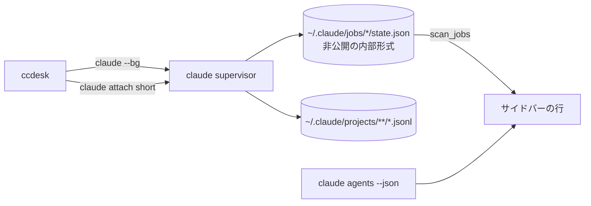
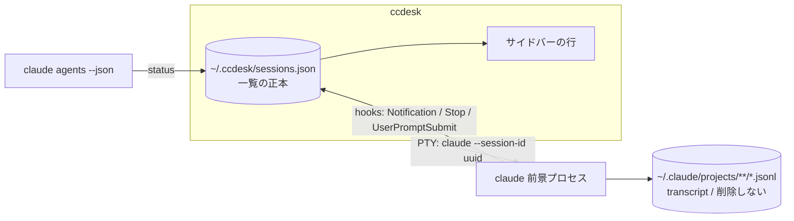

# 前景セッションへの移行

`claude --bg`（バックグラウンド + `claude attach`）で起こしていたセッションを、
**前景起動**（`claude --session-id <uuid>`）へ移行する。

この文書は「なぜそうするか」と「決めたこと」を持つ。**実装の詳細（JSON のキー名・
マージの手順・ロックの待ち時間）はコード側の doc コメントが正本**で、ここには写さない
（写すと片方だけ直った状態が黙って生まれる）。

- 一覧のストア: `src/sessions.rs`
- 供給元の口: `src/source.rs` の `DataSource`
- 排他と原子的書き込み: `src/lib.rs` の `Lock` / `write_json_atomically` / `reap_leftover_tmp`

## なぜ移行するか

`--bg` はセッションの実体を claude の supervisor に置き、ccdesk はその
`claude attach` クライアントに過ぎない。ここから来る制約が 3 つある。

1. **一覧の正本が ccdesk の外にある。** サイドバーの行は
   `~/.claude/jobs/*/state.json` の直読みで、これは**公式に文書化されていない内部形式**。
   claude 側の都合で形が変わると一覧が黙って壊れる。
2. **行に出せる情報が supervisor の都合で決まる。** 要約文（`detail` / `needs` /
   `output.result`）は state.json にしか無く、ライブ状態（`claude agents --json`）とは
   別の鮮度で動く ＝ 行の中で 2 つの時刻が混ざる。
3. **transcript の扱いが読めない。** `--bg` のセッションは
   `~/.claude/projects/**/*.jsonl` の書かれ方が前景と異なり、再開（`-r`）の体験が揃わない。

前景起動なら実体は ccdesk の子プロセスになり、**一覧の正本を ccdesk 自身が持てる**。
Claude Desktop も同じ構造（独自の JSON ストアを一覧の正本にする）。

## 確定仕様

| 項目 | 決定 |
|:--|:--|
| 起動 | PTY で `claude --session-id <uuid> -n <title>`。`CLAUDE_CODE_CHILD_SESSION` / `CLAUDE_CODE_SESSION_ID` / `CLAUDE_PID` / `CLAUDECODE` / `CLAUDE_JOB_DIR` 等の継承環境変数を除去（継承すると transcript 保存が無効になる実測あり） |
| 一覧の正本 | `~/.ccdesk/sessions.json` |
| title | CLI 本体と同じ優先順: `customTitle` > `aiTitle` > `lastPrompt` > `firstPrompt`。ccdesk のリネームは customTitle の位置 |
| state | hooks（`Notification`=入力待ち / `Stop`=完了 / `UserPromptSubmit`=実行中）+ `claude agents --json` の `status`。**要約文は出さない** |
| 未読 | `updated_at > last_opened_at`。状態ラベルの前に `●` |
| メニュー | ピン留め / 既読にする / 名前を変更 / 閉じる / アーカイブ / 削除 |
| ショートカット | `Ctrl+S` `Ctrl+X` を撤去。予約は `Ctrl+Q` と `Alt+←→` のみ |
| 削除の意味 | ccdesk の一覧から消すだけ。`~/.claude/projects/**/*.jsonl` は消さない |
| 失うもの | ccdesk 終了で全セッション終了（行は残り `-r` で再開）/ 外部からの `claude attach` 不可 / PR番号による Ready for review |

**要約文を出さない**のは項目の削減ではなく、正本を 1 つにするための帰結:
要約は state.json（内部形式）にしか無く、前景セッションはそれを書かない。
行に出るのは「状態」だけになり、状態の出どころは hooks と `agents --json` の 2 つ
（どちらも公式 IF）に揃う。

## データの流れ

移行前 — 一覧の正本が ccdesk の外（内部形式の直読み）:

移行後 — 一覧の正本は ccdesk、状態は公式 IF だけから来る:

行の identity は `session_id`（起動時に ccdesk が採番する UUID）。
`claude --session-id` へ渡した値がそのまま transcript の `sessionId` になるので、
**ccdesk の行と claude 側の記録が同じ鍵で結びつく**（`short` のような ccdesk 独自の
中間 ID を持たない）。

## 一覧の正本を持つことで解く問題

`~/.ccdesk/sessions.json` は **ccdesk を複数起動すると共有される**。
これは登録プロジェクト（`~/.ccdesk/state.json` の `projects`）と同じ問題で、
同じ形で解く:

- 書く前にディスクを読み直し、**3 方向マージ**（disk / baseline / next）してから置く
- `baseline` ＝「ディスクはこうなっている」とこのインスタンスが最後に判断した内容。
  `next` との差が**このインスタンスの操作**なので、「消した」と「知らない」を区別できる
- 排他は既存の advisory lock（`Lock`）、置き換えは `write_json_atomically`（tmp → rename）、
  rename 前に死んだ tmp は起動時に `reap_leftover_tmp` が回収する

守る不変条件は 2 つ。**他インスタンスが起こしたセッションを一覧から落とさない**
（落とすとプロセスは生きているのにどのウィンドウからも開けなくなる）ことと、
**自分が消した行を自分の次の書き込みで復活させない**こと。
行ごとの衝突（同じセッションを両方が触った）は `updated_at` の後勝ちで決める。
詳細な意味論は `src/sessions.rs` の `merge_sessions` の doc コメントが正本。

**上限は設けない。** 登録プロジェクト（自動登録なので溢れる）と違い、行が増えるのは
ユーザーがセッションを起こしたときだけで、減らす手段（アーカイブ・削除）もある。
上限で押し出すとユーザーが起こしたセッションが黙って消える。

## フェーズ

移行は 4 段階に割る。各段階の終わりで `cargo build` / `cargo test` が通り、
**アプリとして壊れていない**状態を保つ。

### フェーズ1: 一覧のストアを足す（この文書と同時に入る）

- `SessionId` newtype / `TitleSource` / `SessionRow` / `SessionStore`（`src/sessions.rs`）
- `DataSource::sessions` / `store_sessions`（`LiveSource` / `DemoSource` / テスト供給元）
- 単体テスト（マージ・ロック・原子的書き込み・tmp 回収）

**追加のみで、既存の bg 経路には触らない。** 新しいストアはまだ UI から使わない。

`SessionId` をこの段階で入れるのは、`short`（jobs ディレクトリ名）と `sessionId`
（UUID）がどちらも素の `String` だと、**移行を半分だけやってもコンパイルが通る**ため。
型で止める。

### フェーズ2: 起動を前景へ差し替える

- `Session::spawn` を `claude attach <short>` から
  `claude --session-id <uuid> -n <title>` へ
- 継承環境変数の除去（上表の一覧。継承すると transcript が保存されない）
- サイドバーの行を `jobs()` から `sessions()` へ載せ替え、`DataSource::jobs` と
  `scan_jobs` / `BgJob` を消す
- 一覧の読み書きを UI に繋ぎ、`src/sessions.rs` 冒頭の `#![allow(dead_code)]` を外す

### フェーズ3: 状態・title・未読

- hooks（`Notification` / `Stop` / `UserPromptSubmit`）で `last_state` を更新
- `claude agents --json` の `status` と突き合わせる
- title の優先順（上表）を実装。ccdesk のリネームは `customTitle` の位置
- 未読（`updated_at > last_opened_at`）と `●` の描画

### フェーズ4: メニューとショートカット

- 二次操作をポップアップへ集約（ピン留め / 既読にする / 名前を変更 / 閉じる /
  アーカイブ / 削除）
- `Ctrl+S` `Ctrl+X` を撤去（予約は `Ctrl+Q` と `Alt+←→` だけ）
- **`src/ui/mod.rs` のサイドバー冒頭コメントを直す。** 「行の正本は agents --json
  （ライブ）+ state.json（summary 補完）」と書いてあるが、実装は state.json 由来の行に
  agents --json を重ねる形で**逆**。移行後の正本は `sessions.json` なので、
  この記述はどのみち書き換わる

## 失うもの（受け入れた代償）

| 失うもの | 代替 |
|:--|:--|
| ccdesk を閉じると全セッションが終了する | 行は `sessions.json` に残り、`claude -r <session-id>` で再開できる |
| 外部のターミナルから `claude attach` で入れない | 前景セッションは ccdesk の子プロセスなので、操作は ccdesk から |
| PR 番号による Ready for review 表示 | state.json（内部形式）の `children` にしか無い情報なので、正本を 1 つにする代償として落とす |
