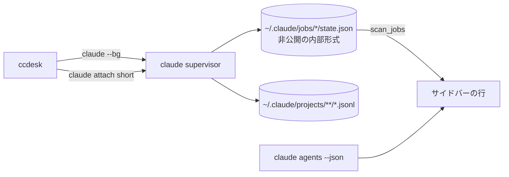
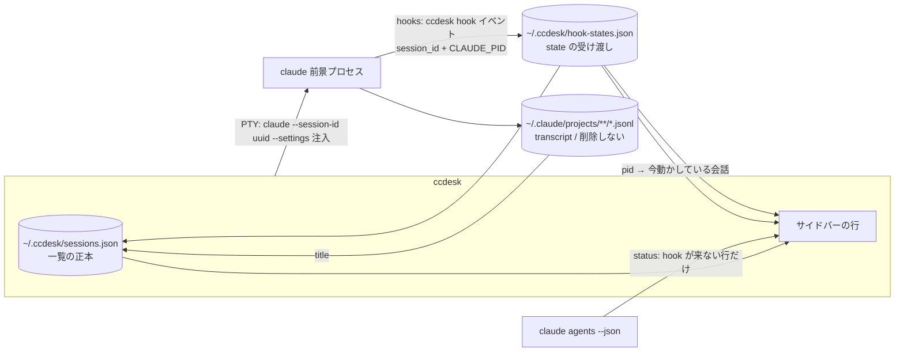

# 前景セッションへの移行

`claude --bg`（バックグラウンド + `claude attach`）で起こしていたセッションを、
**前景起動**（`claude --session-id <uuid>`）へ移行する。

この文書は「なぜそうするか」と「決めたこと」を持つ。**実装の詳細（JSON のキー名・
マージの手順・ロックの待ち時間）はコード側の doc コメントが正本**で、ここには写さない
（写すと片方だけ直った状態が黙って生まれる）。

- 一覧のストア: `src/sessions.rs`
- 状態の受け渡し（注入する hook と、その受け口）: `src/hooks.rs`
- 表示名の決め方（transcript の読みを含む）: `src/title.rs`
- 供給元の口: `src/source.rs` の `DataSource`
- 排他と原子的書き込み: `src/lib.rs` の `Lock` / `write_json_atomically` / `reap_leftover_tmp`

## なぜ移行するか

`--bg` はセッションの実体を claude の supervisor に置き、ccdesk はその
`claude attach` クライアントに過ぎない。ここから来る制約が 3 つある。

1. **一覧の正本が ccdesk の外にある。** サイドバーの行は
   `~/.claude/jobs/*/state.json` の直読みで、これは**公式に文書化されていない内部形式**。
   claude 側の都合で形が変わると一覧が黙って壊れる。
2. **行に出せる情報が supervisor の都合で決まる。** 要約文（`detail` / `needs` /
   `output.result`）は state.json にしか無く、ライブ状態（`claude agents --json`）とは
   別の鮮度で動く ＝ 行の中で 2 つの時刻が混ざる。
3. **transcript の扱いが読めない。** `--bg` のセッションは
   `~/.claude/projects/**/*.jsonl` の書かれ方が前景と異なり、再開（`-r`）の体験が揃わない。

前景起動なら実体は ccdesk の子プロセスになり、**一覧の正本を ccdesk 自身が持てる**。
Claude Desktop も同じ構造（独自の JSON ストアを一覧の正本にする）。

## 確定仕様

| 項目 | 決定 |
|:--|:--|
| 起動 | PTY で `claude --session-id <uuid> [prompt]`。**`-n <title>` は渡さない**（claude が `-n` の名前を transcript の `custom-title` として残すので、ccdesk が組んだ名前を渡すと表示名がそこで凍る）。`CLAUDE_CODE_CHILD_SESSION` / `CLAUDE_CODE_SESSION_ID` / `CLAUDE_PID` / `CLAUDECODE` / `CLAUDE_JOB_DIR` 等の継承環境変数を除去（継承すると transcript 保存が無効になる実測あり） |
| 一覧の正本 | `~/.ccdesk/sessions.json` |
| title の正本 | **transcript**（`custom-title` > `ai-title` > `last-prompt`）。ccdesk のリネームも同じ 1 箇所へ行く: **動いているセッションは PTY へ `/rename <名前>` を送って claude 自身に書かせ**（ペイン内の表示名も同時に変わる）、止まっているセッションだけ ccdesk が `custom-title` を追記する。ストアの `title` は表示用キャッシュ。**読みは初回だけ全体・以降は増えたぶんだけ**（`custom-title` は 1 度しか書かれず末尾に居るとは限らないので、末尾だけ読むと `/resume` のピッカーと名前が食い違う）|
| state | **hooks が主・`claude agents --json` の `status` が従**。どのイベントがどの state を意味するかは `src/hooks.rs` の `HOOK_EVENTS` が正本。**要約文は出さない**（Working / Needs input / Done / Stopped の 4 つだけ） |
| ペイン内の切り替え | `/resume` `/clear` は claude の中で起きるので ccdesk は関与しない。**気づく口は hook**: hook の記録に「その時点の `session_id`」と「呼んだ claude の pid（`CLAUDE_PID`）」が載るので、自分の子の pid で引けば今どの会話を動かしているかが分かる。受け渡しファイルの更新に気づいたら周期を待たずに一覧を読み直す。pid が載らない環境では `claude agents --json` の従経路へ落ちる |
| 未読 | `updated_at > last_opened_at`。行頭 2 桁目に `●` |
| 行の見た目 | 行頭 1 桁目 `❯` ＝ **ペインに出ている行**（名前も太字）、2 桁目 `●` ＝ 未読、次が状態アイコン。行末が `=`（メニュー）。**帯（背景）は選択とホバー、前景の強調は選択だけ**なので、選択・ホバー・ペインに出ているの 3 つが重なっても読める（印は色ではなく文字なので配色に依らない） |
| 選択とペイン | **開く操作のときだけ選択がペインへ揃う**（クリック・メニューの `open`・新規起動・ペイン内の `/resume`）。`↑↓` で選択だけを動かしてもペインは変わらない |
| メニュー | `open` / `pin` / `mark as read` / `rename` / `stop`（プロセスを止める・行は残る）/ `close`（一覧から外す・会話ログは残る） |
| pin | 行を**一覧先頭の `pinned` 節へ移す**（元のグループには残らない ＝ 同じ行が 2 箇所に出ない）。0 本なら節ごと出ない。グルーピング（state / directory）に関係なく同じ位置。**行にアイコンは足さない**（節に入っていること自体が表示）。集計（`N awaiting input · …`）には数える ＝ pin は隠す操作ではないので、見えている行と数が合う |
| ショートカット | `Ctrl+S` `Ctrl+X` を撤去。予約は `Ctrl+Q` と `Alt+←→` のみ |
| `close` の意味 | ccdesk の一覧から外すだけ。`~/.claude/projects/**/*.jsonl` は消さない（だから「削除」とは呼ばない） |
| 失うもの | ccdesk 終了で全セッション終了（行は残り再開できる）/ 外部からの `claude attach` 不可 / PR番号による Ready for review |

**要約文を出さない**のは項目の削減ではなく、正本を 1 つにするための帰結:
要約は state.json（内部形式）にしか無く、前景セッションはそれを書かない。
行に出るのは「状態」だけになり、状態の出どころは hooks と `agents --json` の 2 つ
（どちらも公式 IF）に揃う。

## データの流れ

移行前 — 一覧の正本が ccdesk の外（内部形式の直読み）:

移行後 — 一覧の正本は ccdesk、状態は公式 IF だけから来る:

行の identity は `session_id`（起動時に ccdesk が採番する UUID）。
`claude --session-id` へ渡した値がそのまま transcript の `sessionId` になるので、
**ccdesk の行と claude 側の記録が同じ鍵で結びつく**（`short` のような ccdesk 独自の
中間 ID を持たない）。

## 一覧の正本を持つことで解く問題

`~/.ccdesk/sessions.json` は **ccdesk を複数起動すると共有される**。
これは登録プロジェクト（`~/.ccdesk/state.json` の `projects`）と同じ問題で、
同じ形で解く:

- 書く前にディスクを読み直し、**3 方向マージ**（disk / baseline / next）してから置く
- `baseline` ＝「ディスクはこうなっている」とこのインスタンスが最後に判断した内容。
  `next` との差が**このインスタンスの操作**なので、「消した」と「知らない」を区別できる
- 排他は既存の advisory lock（`Lock`）、置き換えは `write_json_atomically`（tmp → rename）、
  rename 前に死んだ tmp は起動時に `reap_leftover_tmp` が回収する

守る不変条件は 2 つ。**他インスタンスが起こしたセッションを一覧から落とさない**
（落とすとプロセスは生きているのにどのウィンドウからも開けなくなる）ことと、
**自分が消した行を自分の次の書き込みで復活させない**こと。
行ごとの衝突（同じセッションを両方が触った）は `updated_at` の後勝ちで決める。
詳細な意味論は `src/sessions.rs` の `merge_sessions` の doc コメントが正本。

**上限は設けない。** 登録プロジェクト（自動登録なので溢れる）と違い、行が増えるのは
ユーザーがセッションを起こしたときだけで、減らす手段（削除）もある。
上限で押し出すとユーザーが起こしたセッションが黙って消える。

## フェーズ

移行は段階に割る。各段階の終わりで `cargo build` / `cargo test` が通り、
**アプリとして壊れていない**状態を保つ。

### フェーズ1: 一覧のストアを足す（この文書と同時に入る）

- `SessionId` newtype / `TitleSource` / `SessionRow` / `SessionStore`（`src/sessions.rs`）
- `DataSource::sessions` / `store_sessions`（`LiveSource` / `DemoSource` / テスト供給元）
- 単体テスト（マージ・ロック・原子的書き込み・tmp 回収）

**追加のみで、既存の bg 経路には触らない。** 新しいストアはまだ UI から使わない。

`SessionId` をこの段階で入れるのは、`short`（jobs ディレクトリ名）と `sessionId`
（UUID）がどちらも素の `String` だと、**移行を半分だけやってもコンパイルが通る**ため。
型で止める。

### フェーズ2: 所有権を supervisor から ccdesk へ移す（済）

**この段階の本質は起動コマンドの差し替えではなく所有権の反転。** ccdesk の PTY が
`claude attach` のクライアントではなく**セッションそのもの**になり、
「窓を閉じる = プロセスを終わらせる」に変わった。

- `Session::spawn` を前景起動へ（新規 `claude --session-id <uuid> [prompt]` /
  再開 `claude -r <session-id>`）。UUID は ccdesk が採番する（`uuid` crate）
- 継承環境変数の除去（上表の一覧）。`env_clear` ではなく個別除去
  （`CommandBuilder::env_remove`）＝ PATH 等は残す
- 一覧の生成元を `jobs()` から `sessions()` へ載せ替え、`DataSource::jobs` /
  `scan_jobs` / `BgJob` / `iso_to_epoch_ms` を削除。サイドバーの行生成は
  「自 PTY 行 + job 行」の 2 ループから**行の一覧 1 本**へ統合した
- `App` の持ち物を「窓（`windows`）」と「行（`sessions`）」に分けた。
  行の identity は `SessionId`（`RowAction::Open` / `PopupKind::Session` /
  `pending_delete` まで型で通してある）
- プロセスの停止と一覧からの行外しは `claude stop|rm` の起動ではなく `child.kill()` +
  ストア操作へ。**止めても行は消さない**（`last_state` を `stopped` にして残す）
- bg 前提で意味を失ったものを削除: `spawn_rx` / `SpawnOutcome`（PTY 起動は同期で
  数 ms なので別スレッドが要らない）/ 多重ディスパッチの抑止 /
  `rescan_hot_until`（停止・行外しが即時反映になった）/ `seen_alive` と
  `agents --json` の pid 消失による外部 stop 追従（生死は `child.try_wait()` が真実）/
  `run_claude_silent` / `Group::ReadyForReview`（PR 番号は state.json にしか無い）
- `input_gate` は**意味を変えて残した**。宛先は起動時点で決まるので守る対象は
  「子が端末を掴む前の打鍵」になり、降ろす合図は最初の出力（`Session::started`）と
  期限切れの 2 つ。`-r` の再開は読み直しに時間がかかるのでこれが要る
- `poll::AgentInfo` は `sessionId` / `kind` / `status` / `pid` だけを読む形へ。
  state はフェーズ3までの暫定として `status`（busy → Working / それ以外 →
  Needs input）と PTY 生存（無ければ Stopped）から出す
- 一覧の読み書きを UI に繋ぎ、`src/sessions.rs` 冒頭の `#![allow(dead_code)]` を外した

### フェーズ3: 状態・title・未読（済）

**この段階の本質は、行に出る 3 つの値の出どころを公式 IF と ccdesk 自身へ寄せたこと。**
状態は hook（公式 IF）、名前は transcript、未読は行が持つ時刻だけで決まるようになった。

- **状態を hook で取る。** `--settings` へ hook を注入し、受け口は ccdesk 自身の
  サブコマンド（`ccdesk hook <event>`）にした ＝ 外部スクリプトを撒かないので、
  ccdesk を置き換えれば hook も入れ替わる。注入ファイルは使用率表示の statusLine と
  同じ 1 本（`--settings` は 1 つしか渡せない）で、**hook は常に・statusLine は
  opt-in のときだけ**載る
- **載せるのは turn 単位のイベントだけ。** hook は毎回 ccdesk を 1 プロセス起こすので、
  `PreToolUse` / `PostToolUse` のような道具ごとに飛ぶイベントを足すと、Windows の
  プロセス起動コストがそのままセッションの遅さになる
- 受けた state は `~/.ccdesk/hook-states.json` へ置き、TUI が一覧と同じ周期で読む。
  **hook が主・`agents --json` の `status` が従**（hook が一度も来ていない行だけ
  従へ落ちる）で、受けた state は行の `last_state` へも写す
  （写さないと ccdesk を落とした時点で「最後にどうなったか」が消える）
- **前回の実行が残した hook は捨てる**（判断は `hooks.rs` の `HookStates::get`。
  当初は「生きている行の `stopped` を捨てる」形だったが、それはフェーズ6で置き換えた）
- **title は transcript の末尾だけを読む。** `custom-title` / `ai-title` /
  `last-prompt` を拾い、優先順で選ぶ。先頭ユーザープロンプトは起動時に ccdesk が
  渡したものなので transcript を読み直さない（行はすべて ccdesk が起こしている）
- 未読（`updated_at > last_opened_at`）を `●` として描画。
  既読は同じ幅の空白なので桁が動かない。既読になるのは**ペインを開いた時点**と、
  **ペインに出ている行が動いたとき**（見ている行に `●` が点かない）

**受け入れたリスク**: transcript は非公開の内部形式なので、形が変われば
`custom-title` / `ai-title` / `last-prompt` は拾えなくなる。そのときは起動時に
決めた名前（先頭プロンプト / 既定）が残るだけで、機能は落ちない
（パースは行単位で捨てるので壊れた JSON でも止まらない）。

### フェーズ4: メニューとショートカット（済）

**この段階の本質は操作の入口を 1 つにしたこと。** 行への二次操作は
行のメニューだけが持ち、同じ操作のショートカットキーは併設しない。入口が 2 つあると
どちらが正なのか読む側にも実装側にも分岐が生まれ、**予約キーの数だけ
claude 本体のキーバインドが死ぬ**（`Ctrl+S` / `Ctrl+X` は実際に claude 側の打鍵）。

- セッションのメニューを **`open` を先頭に置いた 6 項目**へ（`open` / `pin` /
  `mark as read` / `rename` / `stop` / `close`。語はフェーズ6で実態に合わせた）。落ちるのは `stop` だけで、
  条件は「窓が開いていない」（他は停止中の行にも効く ＝ `open` は止まっている行を起こし直す）。
  `open` は行クリックと同じ `open_session` を通る ＝ 開く経路を 2 つ持たない
- `Ctrl+S` `Ctrl+X` を撤去。**予約キーの判定を 1 つの純関数**
  （`app.rs` の `reserved_key`）へ集め、残る予約が `Ctrl+Q` と `Alt+←→` だけで
  あることをテストで固定した（run ループの中に条件を散らすと検査できない）
- **サイドバーのキーは `↑↓`（選択）と `Enter`（その行の動作）の 2 つだけ。**
  一度は `←` をメニュー・`→` を開くに割り当てたが、**「開く」と「メニュー」の 2 つを
  持つ行はセッション行しか無い**ので、方向で区別すると他の行では案内が嘘になる。
  キーボードからセッションを開く導線はメニューの `open` へ寄せた。
  `←` `→` は予約キーでもサイドバーのキーでもなくなった ＝ 端末側では素通し
  （ペイン移動は `Alt+←→` なので衝突しない）
- **`Enter` が何をするかは行の種類で違うので、その語を型に持たせた**
  （`app.rs` の `Enter` と `Enter::label`）。行の種類 → `Enter` の写像は
  `selected_enter` の網羅 match 1 箇所で、実行（`run_enter`）と下部バーの案内が
  どちらもそこを読む ＝ **種類を足したときに案内だけが黙って古くなることがない**
  （足せばコンパイルが通らない）
- **サイドバーの行は `Option<RowAction>` ではなく `SidebarRow` で持つ**
  （`Decoration` / `Inert` / `Action`）。`None` が「区切り線（実体が無い）」と
  「押しても何も起きない行（実体はある）」の両方を意味していたので、更新の無い版行が
  区切り線と同じ扱いになり、選択・ホバー・ハイライトの 3 経路から一括で漏れていた。
  型で分けたので判断は `SidebarRow::selectable` 1 つに集まる
- 行頭のメニュー記号をハンバーガー記号（U+2630）から `=` へ。あれは East Asian Ambiguous ＝
  幅が端末とフォント設定で 1 桁にも 2 桁にもなるのに、桁の計算は 2 桁と実測した値に
  乗っていた（1 桁と解釈する端末では行全体がずれる）。ASCII なら常に 1 桁で、
  **桁の前提が 1 つ減る**。名前の開始位置は 1 桁左へ寄り、編集中の行頭
  （`ui::mod` の `RENAME_PREFIX`）も対で動く
- `pinned` は**各グループ内の先頭**へ寄せる（安定ソートなので他の相対順は動かない）
- `rename` は**その行がインライン入力に化ける**（別の入力欄を開かない）。
  確定した名前の行き先は transcript の `custom-title`（フェーズ5）。
  入力の作法（挿入・削除・全角の桁）は新規セッション画面と同じ `ui::text_field`
- **マウスで押せるものはキーボードでも押せる**に揃えた。サイドバー本体ではなく
  フッターに描かれるアカウント行も `↑↓` の行き先で、`Enter` はマウスと同じ
  位置に同じメニューを開く。位置は**一覧の行とアカウント行を 1 つで表す型**
  （`app.rs` の `SidebarPos`）が持つ ＝ 「行 index + アカウントか」の 2 つに分けて
  排他が崩れる形にしない。画面 y への写像は `selected_row_y` 1 箇所に閉じ、
  一覧の行は `row_y`、アカウント行は `sidebar_layout` の `account_y`
  （**どちらもマウスの当たり判定と同じ計算**）
- **マウスホバーも選択と同じ `SidebarPos`** で持つ（`App::hovered`）ので、
  アカウント行も一覧の行と同じ帯でハイライトされる。当たり判定は
  クリックと同じ `handle_mouse` の 1 分岐、光らせるかの判断は描画側 1 箇所
  （選択かホバーがその位置を指していれば光る）。アカウント行だけは `Paragraph` で
  描かれるので、**スタイルは `Line` ではなく `Paragraph` 自身に載せる** ＝
  矩形全体が塗られて一覧の行（`ListItem`）と同じ行幅の帯になる
- 下部のヒントバーは**打鍵が届く先で効くキーだけ**を出す（`ui::mod` の `context_hint`）。
  受け手はフォーカス → 名前の入力 → メニュー → 一覧の順で決まり、**判断の順序は
  run ループのキー配りと同じ**にしてある。順序が別々だと案内と実際の受け手がずれる。
  一覧では選択行の `Enter` の語まで出すので、**下部バーはサイドバーを積んだ後に描く**
  （先に描くと材料が 1 フレーム古くなる）
- 行への操作（ピン留め・名前）は `updated_at` を進めるが**未読を作らない**。
  未読は「見ていない間に新しいことが起きた」の意味なので、自分が触ったことで
  `●` が生えるのは嘘になる（`app.rs` の `edit_row`）
- 一覧から行を外しても消えるのは行だけ。`~/.claude/projects/**/*.jsonl` は残す
  （`claude -r` の材料であり、claude 側の持ち物）

### フェーズ5: 名前の正本を transcript へ寄せ、行と claude の実体を一致させる（済）

**この段階の本質は「行が指しているもの」を claude 側の実体と一致させたこと。**
名前・会話・プロセスの 3 つで、行と claude の記録がずれる経路を閉じた。

- **アーカイブを廃止**（メニュー・`Archived` 節・`SessionRow.archived` ごと）。
  一覧から行を外す操作は行を忘れるだけで transcript を消さないので、
  **archive との差は「戻す導線があるか」だけ**になる ＝ 節を 1 つ増やして
  一覧を二分する価値が無い。メニューは 6 項目（`open` / `pin` / `mark as read` /
  `rename` / `stop` / `close`）
- **名前の正本を transcript の 1 箇所にした。** ccdesk の `rename` は
  `custom-title` を 1 行追記し（claude の `/rename` と同じ形・同じ場所）、
  読み直しは**格下げのガードも `Custom` の行の除外も持たない** ＝
  セッションの中で `/rename` した結果もサイドバーへ出る。
  ストアの `title` は表示用キャッシュ（transcript を読む前でも行に名前が出る）
- **追記は claude が同じファイルへ書いている最中でも壊さない形にした**:
  行 1 本を改行まで含めて 1 回の write で置き、末尾が改行で終わっていなければ
  先に改行を足す。書けなくても ccdesk は落ちない（`error.log` へ記録して諦める）
- **1 ターン目より前のリネームは持ち越す**（`title.rs` の `pending`）。
  transcript は 1 ターン終わるまで作られないので、その間は追記できない。
  自分でファイルを作るのは駄目（会話が無いのに `-r` で開ける形に見える）、
  諦めるのも駄目（1 ターン目の `last-prompt` が名前を黙って上書きする）ので、
  できた時点で載せる
- **`-n <title>` を渡すのをやめた。** claude は `-n` の名前を `custom-title` として
  transcript に残すので、ccdesk が組んだ名前（プロンプト無しなら `new session`）が
  「ユーザーが付けた名前」の位置に入り、**表示名がそこで凍っていた**
  （実データが両方 `new session` / `title_source: custom` になっていた原因）。
  ついでに claude 側の AI 生成名も付かなくなっていた
- **止まっている行の起こし方を transcript の有無で分けた**（`app.rs` の `relaunch`）。
  1 ターンも会話していない行に `claude -r` を打つと `No conversation found` になるので、
  transcript が無い行は**同じ UUID で新規として起こす** ＝ 行の identity は変わらない
- **ペイン内の `/resume` にサイドバーが追従する。** `/resume` は claude の内部で
  起きるので ccdesk は関与しないが、`~/.claude/sessions/<pid>.json`
  （`claude agents --json` 経由）には**その pid の現在の `sessionId`** が載る。
  自分の子の pid は ccdesk が知っているので、**pid → sessionId** で張り替える
  （行が無ければ作り、名前は同じ周期の transcript 読みが入れる）。
  張り替わったら次の起動で開く画面（`last_view`）もそちらへ移す ＝
  終了して開き直したときに `/resume` 前の会話へ戻らない。
  **判定は 1 箇所**（`app.rs` の `follow_session_switches` の比較）で、
  行と `last_view` の更新はそこから呼ぶ `adopt_switched_session` に閉じる
- 未読の `●` を**行頭のメニュー記号の右**へ移した。行を縦に流し読みするときに
  印が 1 つの桁へ揃う（状態ラベルの前だと名前の長さで位置が毎行変わる）。
  既読の桁は空白で確保するので**名前の開始桁は動かない**
- サイドバーの `↑↓` は一覧とアカウント行を**巡回する**（末尾の次は先頭）。
  端で止めると、アカウント行から一覧の先頭へ戻るために一覧全体を遡ることになる
- アカウントメニューの「N sessions will switch」を撤去 ＝ **項目はすべて選んで動くもの**に
  なった（切替の影響は押した後のアカウント行が示す）

**受け入れたリスク**: `ai-title` が末尾の読み取り範囲から遠ざかった長い会話では、
名前が `last-prompt` へ落ちる（格下げのガードを外した代償）。名前を固定したいときは
`rename` で `custom-title` に置ける。また pid の追従は `claude` が中間プロセス越しに
起動する環境（npm 版の `.cmd` シム等）では効かない ＝ 追従しないだけで壊れはしない。

### フェーズ6: 実機で見つかった食い違いを閉じる（済）

**この段階の本質は「画面に出ている値が何を材料にしているか」を揃えたこと。**
どれも実機でしか出ない食い違いで、原因はすべて**同じ問いに 2 つの材料があった**こと。

- **リネームは動いているセッションでは claude に打たせる**（`app.rs` の
  `send_rename_to_session`）。ccdesk が `custom-title` を追記しても
  **claude は自分の transcript を監視していない**ので、ペイン内の表示名は起動時の値
  （`new session`）のまま残っていた。`/rename <名前>` を PTY へ送れば claude が
  表示名と `custom-title` の両方を更新する ＝ ユーザーが手で打つのと同じ結果になり、
  ccdesk が内部形式へ書く必要も消える。止まっている行は送り先が無いので従来どおり追記する
  （分岐はリネームの確定 1 箇所）。**打ちかけの文字は消さない**: 行頭までクリアすれば
  必ず送れるが、それは送信前の取り返せない文字を捨てることになるので、入力欄が空と
  言えないとき（打ちかけがある・応答生成中・許可待ち）は追記側へ倒す。名前は
  `title_text` で 1 行に畳んでから送る（改行・制御文字を PTY へ生で流さない）
- **サイドバー幅は保存値を書き換えない**（`app.rs` の `sidebar_cols` / `fit_sidebar`）。
  端末幅で丸める処理が保存値そのものを上書きしていたので、**端末サイズ変化イベントが
  1 度届くだけで幅が縮み、端末が元に戻っても復元しなかった**（Windows では PTY の
  破棄がこのイベントを連れてくる ＝ セッションを止めるたびに数桁ずつ縮んで見える）。
  保存値はユーザーが選んだ幅の正本のままにし、**画面に出す桁数は端末幅から導く**
  ＝ 書き換える経路はドラッグ 1 つだけになった
- **行の経過時間は `updated_at` だけから出す**（`ui::mod` の `age_secs`）。
  動いている行は「PTY の最後の出力から」を材料にしていたので、フォーカスの出入りや
  claude の描き直しでも新しくなり、**他の行をクリックするだけで 0s へ戻っていた**。
  経過時間の意味を「**その行が今の姿になってからの時間**」＝ 行の内容が最後に実際に
  変わってからの経過に決め、材料も行の側 1 つにした。あわせて `edit_row` は
  **中身が実際に変わったときだけ** `updated_at` を進める（既読の行への `mark as read` の
  ように何も変えない操作で経過時間が戻らない）
- **hook の新旧は時刻で判断する**（`hooks.rs` の `HookStates::get`）。
  以前は「生きている行の `stopped` を捨てる」形だったが、生死の観測（`try_wait`）は
  2 秒周期で遅れて届くので、**`stop` した直後の正当な `stopped` が捨てられ**、
  行が一瞬 `Stopped` になってから `Needs input` へ戻っていた（実データで
  `hook-states.json` が `stopped`、`sessions.json` が `blocked` になっていた原因）。
  判断材料を「**その hook はいつの実行のものか**」へ替え、
  **窓（PTY）を起こした時刻より新しい記録だけ**を採る。窓の時刻を正本にしたのは、
  前景セッションの実体がその子プロセスで起こした瞬間を正確に知っているのがそこだけだから
  （`claude agents --json` の `startedAt` は 2 秒周期の観測なので、再開直後は前回の実行の
  値が残り、自分の子の pid が載らない環境では値そのものが来ない）。
  窓が無い行の hook はすべて過去の実行のもの ＝ 採らない
- **終了時に開いている行を `stopped` として記録する**（`app.rs` の
  `stop_sessions_on_exit`）。記録せずに子を殺すと、次の起動で行が「動いていた頃の
  state」を出し続ける ＝ 死んでいるのに `Needs input` に見える。`last_state` が
  「最後に観測した state」である以上、殺す側は観測者なので記録する義務がある
- メニューの語を実態に合わせた（`close` → `stop` / `delete` → `close`）。
  `delete` は会話ログを消さないので「削除」は嘘で、実態は「一覧から閉じる」。
  プロセスを殺す方は「止める」が実態。無効化の条件も語に合わせて `stop` へ移した
  （窓が無い行 ＝ 止めるプロセスが無い）

## 失うもの（受け入れた代償）

| 失うもの | 代替 |
|:--|:--|
| ccdesk を閉じると全セッションが終了する | 行は `sessions.json` に残り、次の起動で起こし直せる（会話があれば `claude -r`、無ければ同じ UUID で新規） |
| 外部のターミナルから `claude attach` で入れない | 前景セッションは ccdesk の子プロセスなので、操作は ccdesk から |
| PR 番号による Ready for review 表示 | state.json（内部形式）の `children` にしか無い情報なので、正本を 1 つにする代償として落とす |
